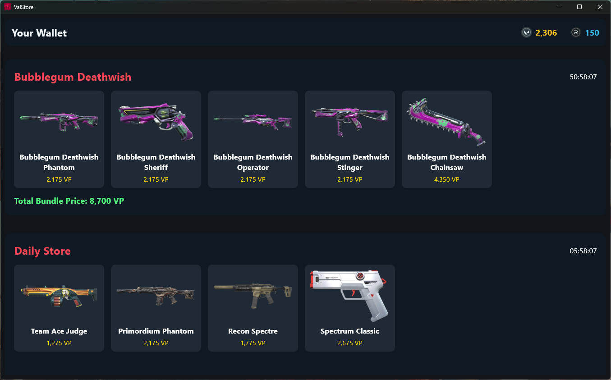

# ValStore - Valorant Daily Store Checker

A beautifully designed GUI application that allows users to view their daily Valorant store skins without opening the game. Users simply need to be signed in to the Riot Client to use this app.

## Features
- Displays daily Valorant store skins and bundles.
- Eliminates the need to open the game to check the store.
- Lightweight and easy to use.
- No installation needed.

## Prerequisites
- Ensure that you are signed in from the Riot client.
 
Riot client does not even to be running in the background, you just have to be signed into it by ticking **Keep signed in** option during login.

## Installation
1. Download the latest release from the [Releases](https://github.com/krmahi/ValStore/releases)
2. Double-click on **valStore.exe** file. That's it.

## Preview

## Building
- install required Dependencies
- `flet pack main.py -n valStore -i "icon file" --add-data "assets;assets" --product-name "ValStore" --file-description "Valorant Store Viewer" --product-version "version name" --file-version "version name"`
- before running input parameters : icon file, version name

## Contributions
Contributions are welcome! Feel free to open an issue or submit a pull request.

---

Feel free to star the repository if you find this application useful! 😊

---

**Author:** [BlueFlareJinx](https://github.com/BlueFlareJinx)
